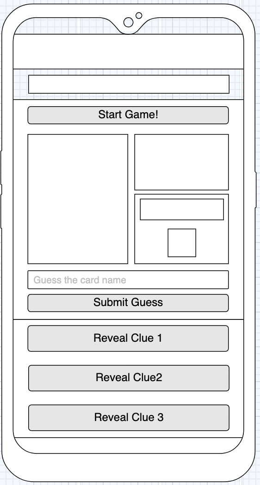

 

# Flavour Points

This website will be designed as a game to test and challenge the knowledge of MtG fans based on MtG flavour and lore.

Providing a short, quiz like structure as its basis, the game will present the user with clues about the identity of a Magic: The Gathering
card that they are trying to guess the name of. I will pull card data from the Scryfall API. The user will be challenged to guess the 
name of five cards, one at a time. The first clue will be the flavour text of the card (Which is traditionally an in game quote or flavourful text based on the card itself)
which is the free clue. Subsequent clues will then cost the user points against their final score in the game.

When a game is finished a pop up will display the user's scorecard and the option to share the game and thier results on social media.
The user can challenge friends to beat their score, or match their perfect score.

The game will contain small advert sections, providing advert revenue on a simple and shareable game with aims of going viral.
 
## UX

This game will suit a mobile first design, as the main user will be mtg players with a majority demographic of males aged from teens upwards. Magic: The Gathering
has made significant inroads into E-Sports recently with their release of MtG: Arena, with the majority of the games coverage being broadcasted on twitch. Most players use mobile devices to read strategy articles
or check card prices on trader websites while trading with other players, making them tech-savvy enough to navigate a intuitive mobile application. The main sources of player to player trading are social media groups and trading websites.

The secondary user would be a partner who advertising on the games single page platform. Their advert banner would generate footfall to their commerse page, which would increase
as the game is shared.

#### Hook

As the game will use JS/Jquery to pull 5 random cards, with flavour text, from a database of thousands, the game will have a variable difficulty every time it is played. This will make the experience new-ish each time.
This also means that while one person could get a really high score from an easy round, their friends may have a hard time beating it. This should cause a repepitive play pattern through the challenge. The sharing of the game and score is very key to this.

Example: 

Player A shares the link with a max score of 35 points. They challenge their MtG facebook friends to play the game and beat their score, each of them does the same. This will expose the advert banner to an ever expanding number of players. 
We can track footfall impact on the advertisers website to see if the process is working.

### Design mockup

## Features

### Existing Features

This guessing game has a resource feature, allowing you to use your points to buy clues.
It implements the card names catalog of the scryfall API to allow the user to select names from a drop down
while guessing. This is helpful as the names selected will match the names in the random cards API, reducing any string comparison mistakes.

### Features Left to Implement
- I would like to add a revealer, that shows the image of the magic card when the user guesses. If they guessed correctly, the card will shrink towards their score 
as it lights up green. If incorrectly, it will shrink towards their lives as it lights up red.

- I would also like to add a ranking table into the localStorage, allowing users to submit their User names and keeping a display of the top 5 players of all time.

## Technologies Used

The strucure and design of this website was built using: 

- HTML
- CSS
- SASS
- Bootstrap

DOM Manipulation was handled by: 

- JavaScript
- JQuery

## Testing

I carried out Jasmine testing late into the build process. This was an oversite as from what I've learned (especially from Dylan Israel's youtube channel), it is much easier
to develop your tests and codes simultainiously.

My main testing was carried out by sharing my github pages deployment with a magic based facebook group and with the developer team at scryfall.

The main issue addressed, was that the autocomplete function was not working when the page was loaded for the first time.
To fix this I removed the list from localStorage and added it to a stored variable, then introduced it as a call back.

Other corrected issues were incorrect button functions and addressing some design issue. 

The majority of my testing conversations can be seen in the imgs/Testing/Screenshot... path.

## Deployment

This page has been deloyed on github pages, and deloyed throughout discord and facebook.

The link can be found here: https://jpmurdie.github.io/Milestone-Project-2-Guess-the-Card/

## Credits
Thanks to the following for your help on this project:

Dylan Israel's Youtube channel
Scryfall Discord channel
CI Slack
My mentor Reuben F

### Content
The conent for this page is all generated my the Scryfall MtG API.

### Media
The add banner on the website was taken from starcitygames.com, it covers a link to their page.

### Acknowledgements
- I received inspiration for this project from magic tournament coverage, sometimes the commentators like to challenge each other
on their knowledge and test their ability on knowing the flavour text of magic cards.